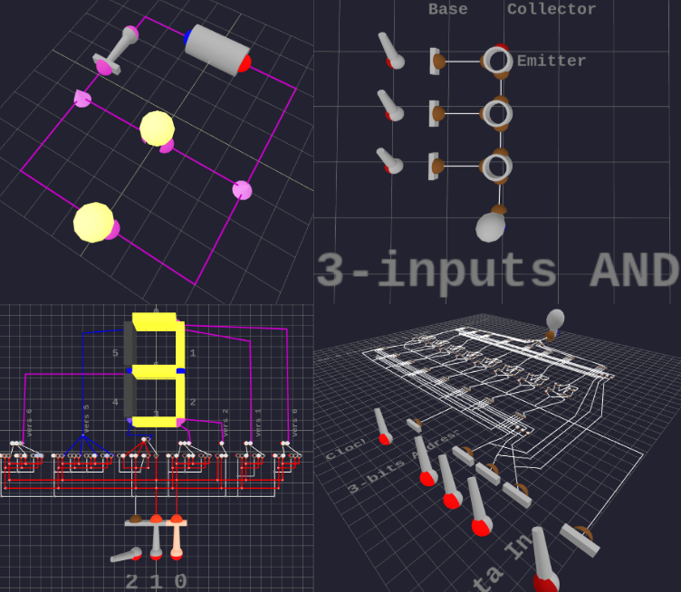

# Simple Circuit Engine

[![NPM Package][npm]][npm-url]

## TypeScript Educational Electronic circuit library

The aim of the project is to provide a simple and easy to use electronic circuit simulation engine for educational purposes.
It allows users to create, edit and simulate electronic circuits in a web environment using [three.js](https://threejs.org/) for 3D rendering.



Visit the [Demo page](https://demo.beyondtheswitch.net/) to see the library in action.

### Use Cases

The goal of this project is to vulgarize the bridge between **electronics**, the physical world and **informatic**, the abstract world that runs upon the former.
The electrical model is deliberately simplified to the bare minimum needed to vulgarize circuits automation:

- Electric states in nodes / wires are just two booleans : if there is tension or not and if there is current or not.
- Components react to changes of inputs discretely with transitional state lasting N ticks (step) before their outputs change.
- Changes in components states affect conductivity (let pass or not) between their pins.
- Changes in electrical states throughout the circuit are then propagated using BFS (Breadth First Search) graph algorithm.

There are some technicalities about initial simulation state computation (to prevent illegal initial states in feedback loop circuits) but that's pretty much all the simulation model does.
It's not a realistic physical model but a **discrete graph model** and for the current scope of this project that's enough.

However if you're searching for an open-source real electrical simulation model, you might want to check:

- [circuitjs](https://github.com/sharpie7/circuitjs1) for a web implementation
- The very complete [ngspice](https://ngspice.sourceforge.io/) (desktop) which is [SPICE](https://en.wikipedia.org/wiki/SPICE) compatible.

### Usage

In addition to `simple-circuit-engine` you must import the `three` and `lil-gui` libraries in your project to use Simple Circuit Engine.
This code set up the main CircuitEngine instance in edit mode on a new Circuit, handles THREE.js objects creation and rendering/animation in the canva-container HTML element.

```javascript
import { WebGLRenderer, Clock } from 'three';
import { Circuit, CircuitOptions, BehaviorRegistry, registerBasicComponentsBehaviors } from 'simple-circuit-engine/core';
import { CircuitEngine, engineOptions, GroupedFactoryRegistry, DefaultVisualFactory, registerBasicComponentsBehaviors } from 'simple-circuit-engine/scene';

// Create component factory registry with basic components visual factories (for scene objects creation - rendering)
const componentsFactoryRegistry = registerBasicComponentsFactories(new GroupedFactoryRegistry(new DefaultVisualFactory()));
// Create behavior registry with basic components behaviors (for simulation)
const behaviorRegistry = registerBasicComponentsBehaviors(new BehaviorRegistry());

// Create and setup WebGL renderer (must exist before engine.initialize — it binds MapControls to the canvas)
const renderer = new WebGLRenderer({ antialias: true, alpha: false });
renderer.setClearColor(0x1a1a2e);
const container = document.getElementById('canva-container')!;
renderer.setSize(container.clientWidth, container.clientHeight);
renderer.setPixelRatio(Math.min(window.devicePixelRatio, 2));

// Initialize CircuitEngine
// It creates THREE.js scene, camera, controls, lights, etc
// and the interactive controllers (edit and simulation) of simple-circuit-engine
const engine = new CircuitEngine(componentsFactoryRegistry, behaviorRegistry);
engine.initialize(container, renderer, engineOptions());
// set engine circuit to a new empty circuit
engine.setCircuit(new Circuit(new CircuitOptions()));

// Append renderer to DOM
container.appendChild(renderer.domElement);

// Animation loop
const clock = new Clock();
function animate() {
    requestAnimationFrame(animate);
    const delta = clock.getDelta();
    engine.update(delta);
    engine.getControls().update();
    renderer.render(engine.getScene(), engine.getCamera());
}
animate();
```

If this goes well, you should see a 10\*10 3D grid with some lights and camera mapControls in the canvas container.

### Contributing

Feel free to open issues or submit pull requests for bug fixes, improvements, or new features.
Particularly, since this project is at early stage issues reports and discussions about desired features are very welcome!
If you're interested in contributing, please read the [CONTRIBUTING](CONTRIBUTING.md) guide for more information.

### License

This project is licensed under the MIT License. See the [LICENSE](LICENSE) file for details.

[npm]: https://img.shields.io/npm/v/simple-circuit-engine
[npm-url]: https://www.npmjs.com/package/simple-circuit-engine
