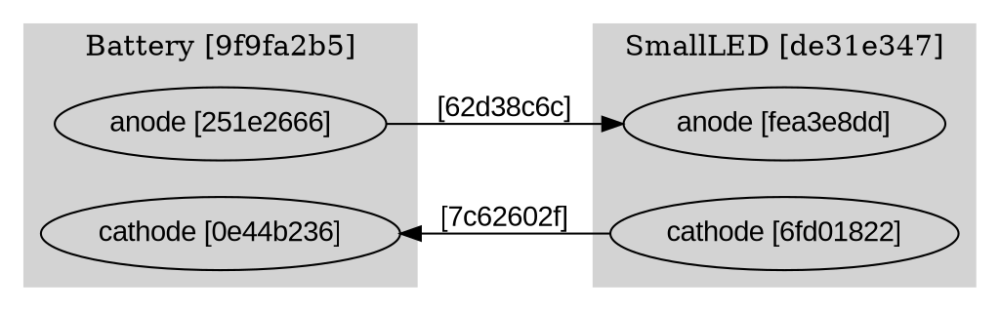

# Data Model: Circuit Topology Visualizer

**Feature**: 002-topology-visualizer
**Date**: 2025-11-29

## Overview

This document defines the data structures and transformations used in the circuit topology visualizer. The visualizer transforms Circuit JSON into DOT graph syntax for rendering.

## Input Data Model

### Circuit JSON Schema

Source: Feature 001 (Circuit.toJSON() output)

```typescript
interface CircuitJSON {
  metadata: CircuitMetadata;
  components: ComponentJSON[];
  enodes: EnodeJSON[];
  wires: WireJSON[];
}

interface CircuitMetadata {
  name: string;
  size: number;
  divisions: number;
  cameraStartup: {
    x: number;
    y: number;
    z: number;
  };
}

interface ComponentJSON {
  id: string;              // UUID
  type: string;            // "battery", "switch", "smallLED", "relay", "transistor", etc.
  position: {
    x: number;
    y: number;
  };
  rotation: number;
  pins: string[];          // Array of ENode UUIDs
}

interface EnodeJSON {
  id: string;              // UUID
  type: "Pin";             // ENode type (always "Pin" in current model)
  source: "Voltage" | "Current" | null;
  component?: string;      // UUID of parent component (if pin-type)
  pinLabel?: string;       // Semantic label: "anode", "cathode", "base", etc.
}

interface WireJSON {
  id: string;              // UUID
  node1: string;           // ENode UUID
  node2: string;           // ENode UUID
  intermediatePositions: Position[];  // Unused for topology (spatial layout)
}
```

### ENode Classification

**Pin-Type ENode**:
- Has `component` field (references parent component)
- Has `pinLabel` field (semantic name)
- Displayed as sub-element within component node in graph

**Branching-Point ENode**:
- No `component` field (standalone junction point)
- May or may not have `pinLabel`
- Displayed as small intermediate node in graph

## Internal Data Model

### Parsed Circuit Structure

```typescript
interface ParsedCircuit {
  metadata: CircuitMetadata;
  components: Map<string, ParsedComponent>;  // Key: component UUID
  enodes: Map<string, ParsedEnode>;          // Key: enode UUID
  wires: ParsedWire[];
}

interface ParsedComponent {
  id: string;
  type: string;
  shortId: string;         // First 8 chars of UUID
  pins: ParsedPin[];       // Pin-type enodes belonging to this component
}

interface ParsedPin {
  id: string;
  shortId: string;         // First 8 chars of UUID
  label: string;           // Semantic pin label (e.g., "anode")
  source: "Voltage" | "Current" | null;
}

interface ParsedEnode {
  id: string;
  shortId: string;         // First 8 chars of UUID
  type: "pin" | "branch";  // Classified type
  componentId?: string;    // For pin-type enodes
  label?: string;          // Pin label if available
}

interface ParsedWire {
  id: string;
  shortId: string;         // First 8 chars of UUID
  node1: string;           // ENode UUID
  node2: string;           // ENode UUID
}
```

## Output Data Model

### DOT Graph Structure

```typescript
interface DOTGraph {
  header: string;          // "digraph circuit { ... }"
  attributes: string[];    // Graph-level attributes (rankdir, etc.)
  subgraphs: DOTSubgraph[]; // Component clusters
  nodes: DOTNode[];        // Branching point nodes
  edges: DOTEdge[];        // Wire edges
}

interface DOTSubgraph {
  id: string;              // "cluster_<component-uuid>"
  label: string;           // "ComponentType [shortId]"
  style: string;           // "filled"
  color: string;           // "lightgrey"
  nodes: DOTNode[];        // Pin nodes within this component
}

interface DOTNode {
  id: string;              // Unique node identifier
  label: string;           // Display text
  shape?: string;          // "point" for branching points, default for pins
  attributes?: Record<string, string>;
}

interface DOTEdge {
  from: string;            // Node ID
  to: string;              // Node ID
  label: string;           // Wire short UUID "[12345678]"
  attributes?: Record<string, string>;
}
```

### DOT Syntax Example



## Data Transformation Pipeline

### Step 1: Parse Circuit JSON

Input: `CircuitJSON`
Output: `ParsedCircuit`

**Transformations**:
1. Extract components and create `Map<uuid, ParsedComponent>`
2. For each component, find pin-type enodes using `component` field
3. Classify remaining enodes as branching points
4. Generate short IDs (first 8 chars) for all entities
5. Create ParsedWire array with short IDs

**Validation**:
- All component.pins references must resolve to valid enodes
- All wire.node1/node2 references must resolve to valid enodes
- Pin-type enodes must have both `component` and `pinLabel` fields

### Step 2: Build DOT Graph

Input: `ParsedCircuit`
Output: DOT string

**Transformations**:
1. Generate graph header and attributes
2. For each component:
   - Create subgraph `cluster_<componentId>`
   - Set label: `"<type> [<shortId>]"`
   - Add pin nodes: `pin_<pinId> [label="<pinLabel> [<shortId>]"]`
3. For each branching-point enode:
   - Create standalone node: `enode_<enodeId> [label="[<shortId>]" shape=point]`
4. For each wire:
   - Create edge: `<fromNodeId> -> <toNodeId> [label="[<shortId>]"]`
   - Map enode UUIDs to DOT node IDs (pin or enode prefix)

**Node ID Mapping**:
- Pin-type enode → `pin_<uuid>`
- Branching-point enode → `enode_<uuid>`
- Component → `cluster_<uuid>` (subgraph ID)

### Step 3: Render Graph

Input: DOT string
Output: SVG rendered in browser DOM

**Process**:
1. Initialize d3-graphviz with target container element
2. Pass DOT string to `.renderDot(dotString)`
3. d3-graphviz handles Graphviz layout and SVG generation
4. SVG is inserted into DOM

## Error Handling

### Validation Errors

**Invalid JSON Structure**:
- Missing required fields (metadata, components, enodes, wires)
- Type mismatches (string instead of array, etc.)

**Error Response**:
```typescript
interface ValidationError {
  type: "validation";
  message: string;
  field?: string;
}
```

**Referential Integrity Errors**:
- Component references non-existent pin
- Wire references non-existent enode
- Pin-type enode missing component or pinLabel

**Error Response**:
```typescript
interface IntegrityError {
  type: "integrity";
  message: string;
  entityId: string;
  referenceId: string;
}
```

### Rendering Errors

**DOT Generation Failure**:
- Malformed DOT syntax
- Graph too large for layout engine

**Error Response**:
```typescript
interface RenderError {
  type: "render";
  message: string;
  dotSnippet?: string;  // Problematic DOT section
}
```

## State Management

### Application State

```typescript
interface VisualizerState {
  status: "idle" | "loading" | "rendering" | "success" | "error";
  circuitJson: string | null;      // Raw input JSON
  parsedCircuit: ParsedCircuit | null;
  dotGraph: string | null;
  error: ValidationError | IntegrityError | RenderError | null;
}
```

**State Transitions**:
1. `idle` → `loading` (user inputs JSON)
2. `loading` → `rendering` (JSON parsed successfully)
3. `rendering` → `success` (graph rendered)
4. `loading/scene` → `error` (validation/render failure)
5. `error` → `idle` (user clears error)

## Performance Considerations

### UUID Shortening Strategy

**Rationale**: Full UUIDs (36 chars) clutter the visualization

**Implementation**:
- Use first 8 characters: `9f9fa2b5-6ce0-43ad-9a6b-f3f4cf8c901b` → `9f9fa2b5`
- Collision risk: Negligible for circuits with <1000 entities
- Uniqueness within circuit: Sufficient for debugging

### Memory Footprint

**Target**: Support circuits with 50 components (~150 enodes, ~200 wires)

**Estimated Data Sizes**:
- Circuit JSON: ~50KB (50 components × 1KB)
- Parsed structures: ~100KB (in-memory objects)
- DOT string: ~30KB (text representation)
- Rendered SVG: ~200KB (DOM)

**Total**: <500KB - acceptable for browser

### Rendering Performance

**Target**: <3 seconds for 50-component circuit

**Breakdown**:
- JSON parsing: <100ms
- DOT generation: <200ms
- Graphviz layout: <2s (handled by d3-graphviz/WASM)
- SVG rendering: <500ms

**Optimization**: None required for MVP (circuits under 50 components)
