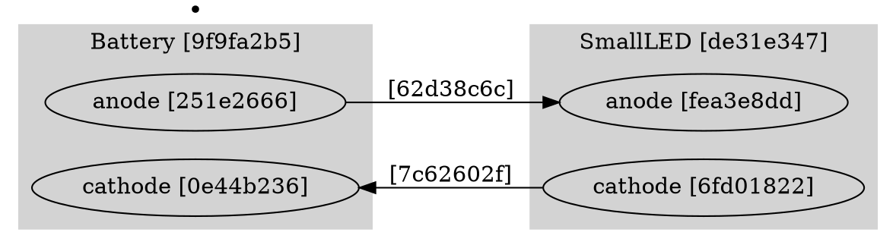

# Research: Circuit Topology Visualizer

**Feature**: 002-topology-visualizer
**Date**: 2025-11-29
**Status**: Complete

## Technology Decisions

### Visualization Library Selection

**Decision**: d3-graphviz

**Rationale**:
- Native DOT language support (Graphviz rendering in browser)
- Well-maintained library with D3.js integration
- Supports complex graph layouts automatically
- Bundleable with Vite for standalone deployment
- Works offline when bundled
- Supports all required features:
  - Subgraphs/clusters for grouping pins within components
  - Edge labels for wire UUIDs
  - Node labels for component types and pin information
  - Automatic layout algorithms (dot, neato, etc.)

**Alternatives Considered**: None - decision provided by project requirements

**Integration Approach**:
- Add d3-graphviz and d3 as project dependencies
- Build visualizer with Vite in library mode
- Bundle to single JS file for standalone HTML page
- Use TypeScript for type safety

### DOT Graph Generation Strategy

**Decision**: Generate DOT syntax programmatically from circuit JSON

**Key Patterns**:

1. **Component Representation**: Use DOT subgraphs with `cluster_` prefix to group pins within components
   ```dot
   subgraph cluster_component_uuid {
     label = "ComponentType [uuid]";
     pin1 [label="anode [uuid]"];
     pin2 [label="cathode [uuid]"];
   }
   ```

2. **Branching Point Representation**: Use regular DOT nodes
   ```dot
   enode_uuid [label="[uuid]" shape=point];
   ```

3. **Wire Representation**: Use DOT edges with labels
   ```dot
   node1 -> node2 [label="[uuid]"];
   ```

4. **UUID Display**: Show first 8 characters for all entities
   - Component nodes: "Type [12345678]"
   - Pin nodes: "label [12345678]"
   - Branching points: "[12345678]"
   - Wire edges: label="[12345678]"

### Build Configuration

**Decision**: Vite library mode with separate entry point for visualizer

**Configuration**:
- Entry: `scripts/visualizer/src/main.ts`
- Output: `output/circuit-topology-visualizer.js` (bundled)
- Format: IIFE (immediately-invoked function expression) for standalone HTML
- Dependencies: Inline d3-graphviz and d3 into bundle
- HTML: `scripts/visualizer/circuit-topology-visualizer.html` (copied to output/)

### Testing Strategy

**Decision**: Unit tests for parser and graph builder, integration test for rendering

**Test Coverage**:
1. **Parser Tests**: Validate circuit JSON parsing, error handling for malformed input
2. **Graph Builder Tests**: Verify DOT syntax generation for various circuit structures
3. **Integration Tests**: End-to-end validation (JSON → DOT → rendered graph)

**Test Data**: Use sample circuits from feature 001 (relay, transistor, LED circuits)

## Technical Constraints Resolved

### Offline Capability
- Bundle all dependencies with Vite
- No CDN links in HTML
- Use data URLs or inline SVG for any assets

### File Protocol Compatibility
- Avoid dynamic imports that fail with file://
- Use IIFE bundle format
- No server-side rendering required

### Performance Target (3 seconds for 50 components)
- d3-graphviz handles automatic layout efficiently
- DOT generation is linear with circuit size
- Browser rendering is fast for graphs of this scale

## Implementation Notes

### DOT Subgraph Syntax for Pin Grouping

Pins are component properties, not standalone nodes. Use DOT's `subgraph cluster_*` feature:



### Circuit JSON Structure Reference

Based on feature 001 sample circuits:
- `metadata`: { name, size, divisions, cameraStartup }
- `components`: Array of { id, type, position, rotation, pins[] }
- `enodes`: Array of { id, type, source, component?, pinLabel? }
- `wires`: Array of { id, node1, node2, intermediatePositions[] }

**ENode Types**:
- `type: "Pin"` with `component` field → pin-type enode (grouped with component)
- `type: "Pin"` without `component` field → branching-point enode (standalone node)

## Dependencies to Add

```json
{
  "dependencies": {
    "d3": "^7.9.0",
    "d3-graphviz": "^5.6.0"
  },
  "devDependencies": {
    "@types/d3": "^7.4.3",
    "@types/d3-graphviz": "^2.6.10"
  }
}
```

## Next Steps

Phase 1: Design
- Create data-model.md (circuit JSON schema, DOT graph structure)
- Create contracts/ (visualizer API, error responses)
- Create quickstart.md (how to use the visualizer)
- Update agent context (CLAUDE.md)
