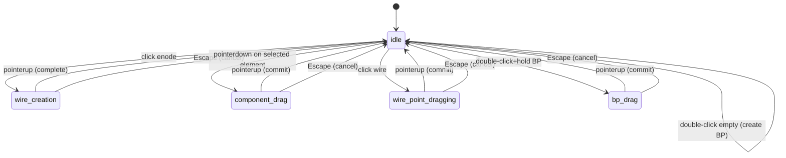

# Data Model: Build Tool Merge

**Feature**: 010-build-tool-merge
**Date**: 2025-12-17
**Purpose**: Document the state machine and data structures for BuildTool

## Overview

BuildTool is a stateful class that transitions between multiple modes based on user interactions. This document defines the state machine, state-specific data structures, and validation rules.

## State Machine

### BuildToolMode Enum

```typescript
/**
 * Operating modes for BuildTool
 *
 * State transitions:
 *   idle → wire_creation (click enode)
 *   idle → component_drag (pointerdown on selected element)
 *   idle → wire_point_dragging (click wire or intermediate point)
 *   idle → bp_drag (double-click+hold branching point)
 *   {any active mode} → idle (pointerup, Escape, or operation complete)
 */
type BuildToolMode =
  | 'idle'                   // No active operation
  | 'wire_creation'          // Creating wire from source to target
  | 'component_drag'       // Dragging component or branching point
  | 'wire_point_dragging'    // Dragging wire intermediate point
  | 'bp_drag';           // Dragging standalone branching point
```

### State Diagram



### Mode Transition Rules

| From Mode | Event | To Mode | Condition |
|-----------|-------|---------|-----------|
| idle | pointerdown | wire_creation | hoveredElement.type === 'enode' |
| idle | pointerdown | component_drag | selection exists AND hoveredElement matches selection |
| idle | pointerdown | wire_point_dragging | hoveredElement.type === 'wire' |
| idle | pointerdown | bp_drag | hoveredElement.type === 'enode' AND isBranchingPoint AND recentCancel |
| {any} | pointerup | idle | Always (commit or complete) |
| {any} | Escape | idle | Always (cancel) |
| idle | Delete/Backspace | idle | selection exists (delete element) |
| idle | R | idle | selection.type === 'component' (rotate) |
| idle | dblclick | idle | Various targets (rotate/create BP) |

## State-Specific Data Structures

### WireCreatingState

Stores information during wire creation operation.

```typescript
interface WireCreatingState {
  /**
   * UUID of the source enode (pin or branching point)
   */
  sourceEnodeId: UUID;

  /**
   * World position of source enode (for preview line start)
   */
  sourcePosition: THREE.Vector3;

  /**
   * Preview wire object (Line2) rendered during creation
   * Follows cursor position until target selected
   */
  previewWire: Line2 | null;

  /**
   * Timestamp when operation started (for double-click disambiguation)
   */
  ts: number;
}
```

**Validation Rules**:
- `sourceEnodeId` must exist in circuit model
- `sourcePosition` must be valid Vector3 (not NaN)
- `previewWire` must be disposed on cancel/complete
- `ts` must be positive number (Date.now())

**Lifecycle**:
- Created: When user clicks enode
- Used: During gridPositionMove (update preview endpoint)
- Cleared: On pointerup (complete wire) or Escape (cancel)

### ElementDragState (renamed from DragState)

Stores information during component or branching point drag.

```typescript
interface ElementDragState {
  /**
   * Current selection being dragged
   */
  selection: SelectionData;

  /**
   * Original positions of all dragged objects (for cancel)
   * Maps UUID → {type, position}
   */
  positionsAtStart: Map<UUID, { type: HoverableType; position: THREE.Vector3 }>;

  /**
   * World position where drag started (for delta calculation)
   */
  startPosition: THREE.Vector3;

  /**
   * Current cursor position (updated during drag)
   */
  currentPosition: THREE.Vector3;
}
```

**Validation Rules**:
- `selection` must exist and match current selection
- `positionsAtStart` must contain entry for each dragged object
- `startPosition` and `currentPosition` must be valid Vector3
- All positions in map must be valid (not NaN)

**Lifecycle**:
- Created: On pointerdown with selected element
- Used: During gridPositionMove (update positions with delta)
- Cleared: On pointerup (commit to model) or Escape (restore original)

### WirePointDragState (renamed from WireDragState)

Stores information during wire intermediate point drag.

```typescript
interface WirePointDragState {
  /**
   * UUID of wire being modified
   */
  wireId: UUID;

  /**
   * Index in intermediatePositions array
   * Or index where new point will be inserted
   */
  pointIndex: number;

  /**
   * Initial world position of drag start
   */
  initialPosition: THREE.Vector3;

  /**
   * Original intermediate positions (for cancel)
   * Snapshot of wire.intermediatePositions before drag
   */
  originalPositions: { x: number; y: number }[];

  /**
   * Target type determines behavior:
   * - 'intermediate': Dragging existing point
   * - 'new_intermediate': Creating and dragging new point
   */
  targetType: 'intermediate' | 'new_intermediate';
}
```

**Validation Rules**:
- `wireId` must exist in circuit model
- `pointIndex` must be valid index (0 to originalPositions.length)
- `originalPositions` must match wire's intermediatePositions length (or +1 for new)
- If `targetType === 'intermediate'`, point must exist at pointIndex
- If `targetType === 'new_intermediate'`, point will be inserted at pointIndex

**Lifecycle**:
- Created: On pointerdown on wire or intermediate point
- Used: During gridPositionMove (update point position)
- Cleared: On pointerup (commit, with merge/delete check) or Escape (restore)

**Special Behavior**:
- On commit: Check if point should merge with endpoint or other point
- If merged: Remove point from array
- If too close to endpoint (<0.5 grid units): Remove point

### BPDragState

Stores information during branching point drag.

```typescript
interface BPDragState {
  /**
   * UUID of branching point being dragged
   */
  enodeId: UUID;

  /**
   * Initial world position (for cancel)
   */
  initialPosition: THREE.Vector3;
}
```

**Validation Rules**:
- `enodeId` must be a standalone branching point (not component pin)
- `enodeId` must exist in circuit model
- `initialPosition` must be valid Vector3

**Lifecycle**:
- Created: On double-click+hold on branching point
- Used: During gridPositionMove (update BP and all connected wires)
- Cleared: On pointerup (commit, with simplify) or Escape (restore)

**Special Behavior**:
- On commit: Simplify intermediate positions of all connected wires
- Updates BP position directly (not via intermediatePositions)

## Entity Relationships

### BuildTool → CircuitSceneManager

```typescript
class BuildTool {
  private _sceneManager: CircuitSceneManager;

  // BuildTool uses CircuitSceneManager for:
  // - Getting Circuit model
  // - Getting Object3D references
  // - Accessing SelectionManager
  // - Accessing WireVisualManager
  // - Accessing CircuitEditionManager
  // - Accessing MapControls (enable/disable pan)
  // - Emitting events
  // - Getting hover state
}
```

### BuildTool → Selection System

```typescript
// Read selection to determine drag eligibility
const selection = this._sceneManager.getSelectionManager().getSelection();

// Modify selection after actions
this._sceneManager.getSelectionManager().selectOne('wire', wireId);
this._sceneManager.getSelectionManager().deselect();
```

### BuildTool → Circuit Model

```typescript
// Read operations
const circuit = this._sceneManager.getCircuit();
const wire = circuit.getWire(wireId);
const enode = circuit.getENode(enodeId);
const component = circuit.getComponent(componentId);

// Write operations (via CircuitEditionManager)
this._sceneManager.addWire(sourceId, targetId);
this._sceneManager.removeWire(wireId);
this._sceneManager.removeComponent(componentId);
this._sceneManager.removeBranchingPoint(enodeId);
this._sceneManager.splitWire(wireId, position);
this._sceneManager.addBranchingPoint(position);

// Update operations
circuit.updateWireIntermediatePositions(wireId, positions, persist);
circuit.simplifyWireIntermediatePositions(wireId);
```

### BuildTool → Visual System

```typescript
// Get Object3D references
const object = this._sceneManager.getObject3D('component', id);
const enodeGroup = this._sceneManager.getEnodeObject3Ds().get(enodeId);

// Update wire visuals
this._sceneManager.getWireVisualManager().updateWireById(wireId);
this._sceneManager.getWireVisualManager().updateWiresForComponent(componentId);
this._sceneManager.getWireVisualManager().refreshWireGeometry(wireId);

// Wire preview operations
const previewWire = this._sceneManager.getWireVisualManager().createPreviewWire(startPos);
this._sceneManager.getWireVisualManager().updatePreviewWire(endPos);
this._sceneManager.getWireVisualManager().removePreviewWire();

// Wire point operations
const nearestPoint = this._sceneManager.getWireVisualManager()
  .findNearestIntermediatePoint(wireId, screenPos);
const insertIndex = this._sceneManager.getWireVisualManager()
  .getInsertIndexForPosition(wireId, worldPos);
```

## Event Emission

BuildTool emits events at key state transitions:

### toolOperationStarted
**Emitted**: When entering active mode (wire_creation, component_drag, etc.)
**Payload**:
```typescript
{
  toolType: 'build',
  operationData: {
    // Mode-specific data (sourceEnodeId, selection, wireId, etc.)
  }
}
```

### toolOperationCompleted
**Emitted**: On successful operation completion (pointerup after drag, wire creation, etc.)
**Payload**:
```typescript
{
  toolType: 'build',
  operationData: {
    // Result data (wireId, componentId, finalPosition, etc.)
  },
  changedData: {
    addedComponents?: UUID[],
    removedComponents?: UUID[],
    addedWires?: UUID[],
    removedWires?: UUID[],
    updatedWires?: UUID[],
    addedENodes?: UUID[]
  }
}
```

### toolOperationCancelled
**Emitted**: When operation cancelled (Escape key)
**Payload**:
```typescript
{
  toolType: 'build'
}
```

### toolValidationError
**Emitted**: When operation fails validation (duplicate wire, invalid placement, etc.)
**Payload**:
```typescript
{
  toolType: 'build',
  errorMessage: string
}
```

### dragStart, dragMove, dragEnd, dragCancel
**Emitted**: During element drag operations (from PositionTool)
**Payloads**:
```typescript
// dragStart
{ selection: SelectionData, startPosition: Vector3 }

// dragMove
{ selection: SelectionData, currentPosition: Vector3, delta: Vector3 }

// dragEnd
{ selection: SelectionData, finalPosition: Vector3 }

// dragCancel
{ selection: SelectionData }
```

### componentRotated
**Emitted**: After component rotation
**Payload**:
```typescript
{
  componentId: UUID,
  newRotation: number  // radians
}
```

## Validation Rules

### Mode Invariants
1. **Single Active Mode**: Only one mode active at a time (others must be 'idle')
2. **State Consistency**: If mode !== 'idle', corresponding state object must be non-null
3. **Event Handlers**: gridPositionMove listener only active when in dragging/creating mode

### Operation Constraints
1. **Wire Creation**:
   - Source enode must exist
   - Target enode must exist
   - Source ≠ Target
   - No duplicate wire between same enodes

2. **Element Dragging**:
   - Element must be selected
   - Component pin enodes cannot be dragged (only standalone BPs and components)
   - Multi-selection not supported (return early)

3. **Wire Point Dragging**:
   - Wire must exist
   - Point index must be valid
   - New point insertion must be between existing endpoints

4. **Rotation**:
   - Only applies to components (not wires or enodes)
   - Selection must be single component (not multi)

5. **Deletion**:
   - Element must be selected
   - Component deletion cascades to connected wires
   - Branching point deletion merges connected wires (if valid)
   - Cannot delete component pin enodes (only standalone BPs)

### Resource Management
1. Preview wire must be disposed when exiting wire_creation mode
2. Camera controls (pan) locked during active operations
3. Camera controls unlocked on operation end (success or cancel)
4. Event listeners added in onActivate(), removed in onDeactivate()

## Type Definitions Summary

```typescript
// Enums
type BuildToolMode = 'idle' | 'wire_creation' | 'component_drag'
                   | 'wire_point_dragging' | 'bp_drag';

// State Interfaces
interface WireCreatingState {
  sourceEnodeId: UUID;
  sourcePosition: THREE.Vector3;
  previewWire: Line2 | null;
  ts: number;
}

interface ElementDragState {
  selection: SelectionData;
  positionsAtStart: Map<UUID, { type: HoverableType; position: THREE.Vector3 }>;
  startPosition: THREE.Vector3;
  currentPosition: THREE.Vector3;
}

interface WirePointDragState {
  wireId: UUID;
  pointIndex: number;
  initialPosition: THREE.Vector3;
  originalPositions: { x: number; y: number }[];
  targetType: 'intermediate' | 'new_intermediate';
}

interface BPDragState {
  enodeId: UUID;
  initialPosition: THREE.Vector3;
}

// BuildTool Class (outline)
class BuildTool implements IEditingTool {
  readonly type: ToolType = 'build';

  private _sceneManager: CircuitSceneManager;
  private mode: BuildToolMode = 'idle';
  private lastCancelledOpTs: number = 0;

  private wireCreatingState: WireCreatingState | null = null;
  private elementDragState: ElementDragState | null = null;
  private wirePointDragState: WirePointDragState | null = null;
  private bpDragState: BPDragState | null = null;

  // IEditingTool interface
  onActivate(): void;
  onDeactivate(): void;
  getCursorType(): CursorType;
  getPreviewObjects(): THREE.Object3D[];

  // Event handlers
  private handlePointerDown(event: MouseEvent): void;
  private handlePointerUp(event: MouseEvent): void;
  private handleGridPositionMove(position: THREE.Vector3): void;
  private handleKeyDown(event: KeyboardEvent): void;
  private handleDblClick(event: MouseEvent): void;

  // Wire creation operations
  private startWireCreation(sourceEnodeId: UUID): void;
  private completeWireCreation(targetEnodeId: UUID): UUID | undefined;
  private cancelWireCreation(): void;

  // Element drag operations
  private startElementDrag(selection: SelectionData): void;
  private updateElementDrag(position: THREE.Vector3): void;
  private commitElementDrag(): void;
  private cancelElementDrag(): void;

  // Wire point drag operations
  private startWirePointDrag(wireId: UUID, targetType: string,
                             pointIndex: number, position: THREE.Vector3): void;
  private updateWirePointDrag(position: THREE.Vector3): void;
  private commitWirePointDrag(): void;
  private cancelWirePointDrag(): void;

  // Branching point drag operations
  private startBPDrag(enodeId: UUID, position: THREE.Vector3): void;
  private updateBPDrag(position: THREE.Vector3): void;
  private commitBPDrag(): void;
  private cancelBPDrag(): void;

  // Rotation operations
  private rotateSelectedComponent(): void;
  private selectAndRotateComponent(componentId: UUID): void;

  // Branching point creation
  private createBranchingPointOnWire(wireId: UUID, position: THREE.Vector3): UUID | undefined;
  private createStandaloneBranchingPoint(position: THREE.Vector3): UUID | undefined;

  // Deletion
  private deleteSelectedElement(): void;

  // Helper methods
  private checkMergeDelete(wire: Wire): { x: number; y: number }[];
}
```

## Persistence Notes

**BuildTool does not introduce new persistence requirements**. All circuit modifications use existing CircuitEditionManager methods that handle model persistence. BuildTool is stateless between sessions - all state is runtime-only and cleaned up on deactivation.
